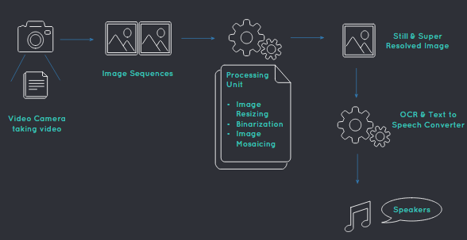
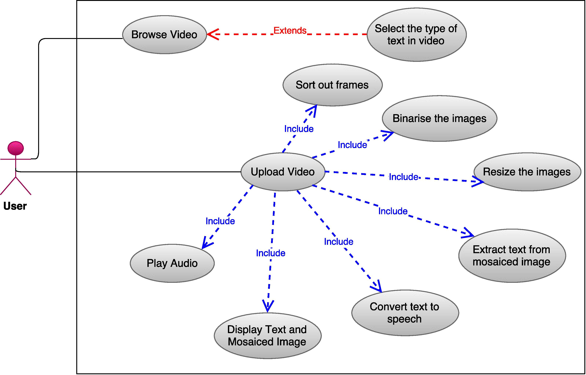
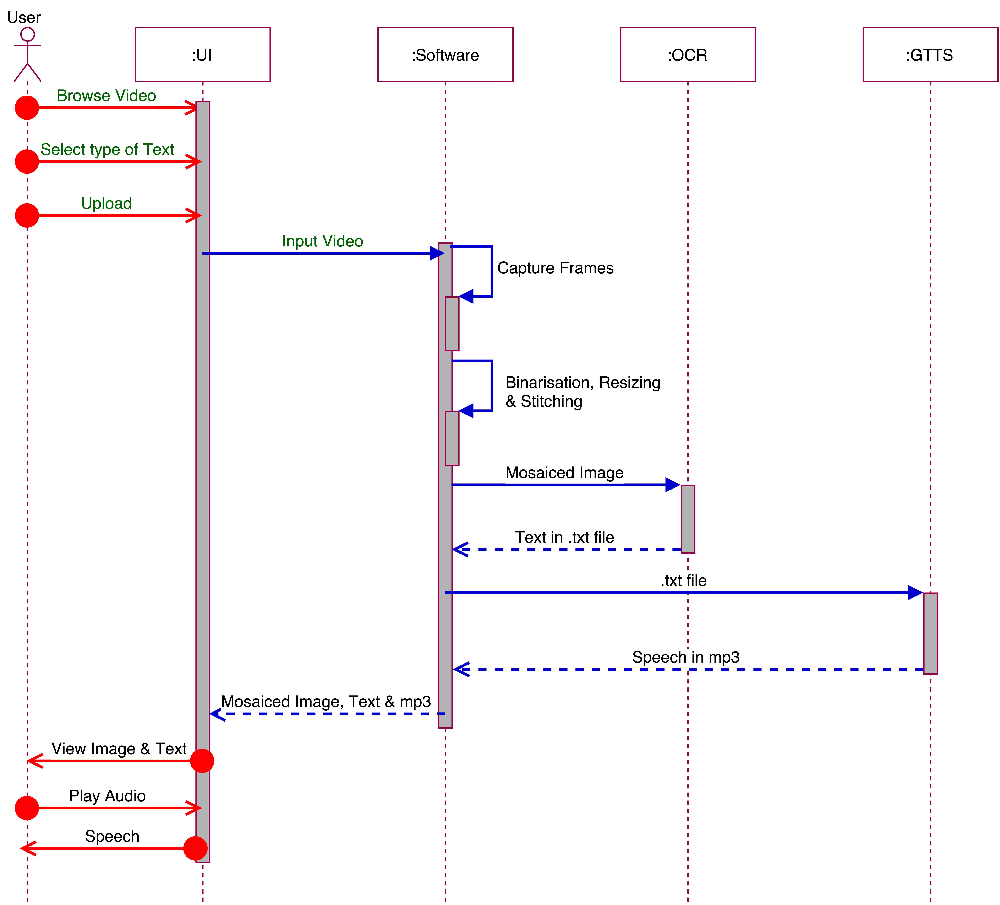
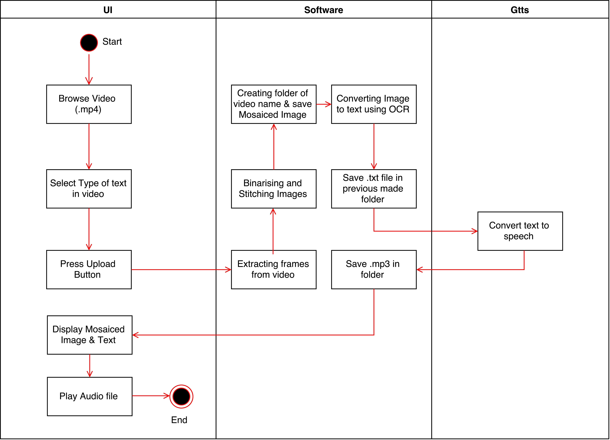

`This is a term project from my undergraduation. It does not exhibit my current programming skills`

----------------------------------------------------------------------------
					TEXTUAL VIDEO TO SPEECH INTERFACE
----------------------------------------------------------------------------

## Objective

Objective is the development of an interface to textual information for the visually impaired that uses video, image processing, optical-character-recognition (OCR) and text-to-speech (TTS). The video provides a sequence of low resolution images in which text must be detected, rectified and converted into high resolution rectangular blocks that are capable of being analyzed via off-the-shelf OCR. To achieve this, various problems related to feature detection, mosaicing, binarization, and systems integration were solved in the development of the system.

For getting the image sequences, frames are cut at regular interval from the video, then pre-processes that image to get a clearer image. After that, using image stiching tool of `OpenCV Python`, a single image of the whole text is generated. Thereafter, that image is given to the `OCR (Tesseract)`, which further give it’s output to the `Google Text To Speech engine (gTTS)` to make a final audio speech output.

## Project Description

### Application Flow

----------------------------------------------------------------------------

### Use Case Diagram

----------------------------------------------------------------------------

### Sequence Diagram

----------------------------------------------------------------------------

### Activity Diagram

----------------------------------------------------------------------------

### Technologies Used

* Programming Language : Python (OpenCV)
* User Interface : Python Flask, HTML
* Optical Character Recognition : Pytesseract
* Text to Speech : gTTS

----------------------------------------------------------------------------

An example of input and output can be found [here](http://home.iitj.ac.in/~ug201313008/project2.html).

----------------------
I. Code Compile & Run
----------------------
Terminal	 	python app.py
Browser			http://127.0.0.3:5000/ or localhost:5000

Note : 5000 is Port Number used in Code. If not working, change it in app.py

-------------
II. File list
-------------
* app.py			Main python code that implements the features
* index.html		First Screen of the Software
* index1.html		Webpage that shows the final image, text & mp3

-----------------
III. Dependencies
-----------------
* [python](https://docs.python.org/2/install/)
* [pip](https://pip.pypa.io/en/stable/installing/)
* [OpenCV](http://goo.gl/lGieGN)
* [Pyttesseract](https://pypi.python.org/pypi/pytesseract)
* [gTTS](https://pypi.python.org/pypi/gTTS)
* [Pillow](https://pypi.python.org/pypi/Pillow/2.2.1)
* [imutils](https://pypi.python.org/pypi/imutils/0.2)
* [numpy](http://docs.scipy.org/doc/numpy-1.10.1/user/install.html)
* [matplotlib](http://matplotlib.org/users/installing.html)
* [flask](https://pypi.python.org/pypi/Flask)
* [werkzeug](http://werkzeug.pocoo.org/docs/0.11/installation/)
* Install os package : `pip install os`
* Install logging package : `pip install logging`

----------------
II. Using the Software
----------------
* Browse .mp4 video and type of text
* Press upload button
* Wait for process to complete
* Output shown on screen
* Output saved in 'static/video_name.mp4/' folder

